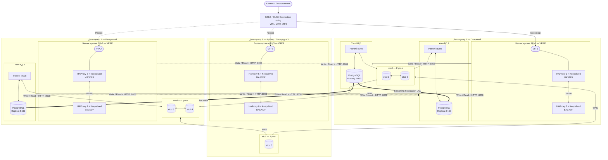

```mermaid
flowchart TB
    Client([Клиенты / Приложения]) --> Router[GSLB / DNS / Connection String<br/>VIP1, VIP2, VIP3]

    subgraph DC1 [Дата-центр 1 — Основной]
        subgraph LB_DC1 [Балансировка ДЦ-1 — VRRP]
            VIP1([VIP 1])
            HA1[HAProxy 1 + Keepalived<br/>MASTER]
            HA2[HAProxy 2 + Keepalived<br/>BACKUP]
            VIP1 --- HA1
            HA1 <-.->|VRRP| HA2
        end

        subgraph Node1 [Узел БД 1]
            PG1[(PostgreSQL<br/>Primary :5432)]
            P1[Patroni :8008]
            P1 <--> PG1
        end

        subgraph Node2 [Узел БД 2]
            PG2[(PostgreSQL<br/>Replica :5432)]
            P2[Patroni :8008]
            P2 <--> PG2
        end

        subgraph ETCD_DC1 [etcd — 2 узла]
            E1[(etcd 1)] <--> E2[(etcd 2)]
        end
    end

    subgraph DC2 [Дата-центр 2 — Резервный]
        subgraph LB_DC2 [Балансировка ДЦ-2 — VRRP]
            VIP2([VIP 2])
            HA3[HAProxy 3 + Keepalived<br/>MASTER]
            HA4[HAProxy 4 + Keepalived<br/>BACKUP]
            VIP2 --- HA3
            HA3 <-.->|VRRP| HA4
        end

        subgraph Node3 [Узел БД 3]
            PG3[(PostgreSQL<br/>Replica :5432)]
            P3[Patroni :8008]
            P3 <--> PG3
        end

        subgraph ETCD_DC2 [etcd — 2 узла]
            E3[(etcd 3)] <--> E4[(etcd 4)]
        end
    end

    subgraph DC3 [Дата-центр 3 — Арбитр / Площадка 3]
        subgraph LB_DC3 [Балансировка ДЦ-3 — VRRP]
            VIP3([VIP 3])
            HA5[HAProxy 5 + Keepalived<br/>MASTER]
            HA6[HAProxy 6 + Keepalived<br/>BACKUP]
            VIP3 --- HA5
            HA5 <-.->|VRRP| HA6
        end

        subgraph ETCD_DC3 [etcd — 1 узел]
            E5[(etcd 5)]
        end
    end

    Router -->|Основной| VIP1
    Router -.->|Резерв| VIP2
    Router -.->|Резерв| VIP3

    LB_DC1 ==>|Write / Read + HTTP :8008| Node1 & Node2 & Node3
    LB_DC2 -.->|Write / Read + HTTP :8008| Node1 & Node2 & Node3
    LB_DC3 -.->|Write / Read + HTTP :8008| Node1 & Node2 & Node3

    PG1 ==>|Streaming Replication LAN| PG2
    PG1 ==>|Streaming Replication WAN| PG3

    ETCD_DC1 <-->|WAN| ETCD_DC2
    ETCD_DC2 <-->|WAN| ETCD_DC3
    ETCD_DC1 <-->|WAN| ETCD_DC3

    P1 & P2 <--> ETCD_DC1
    P3 <--> ETCD_DC2
```